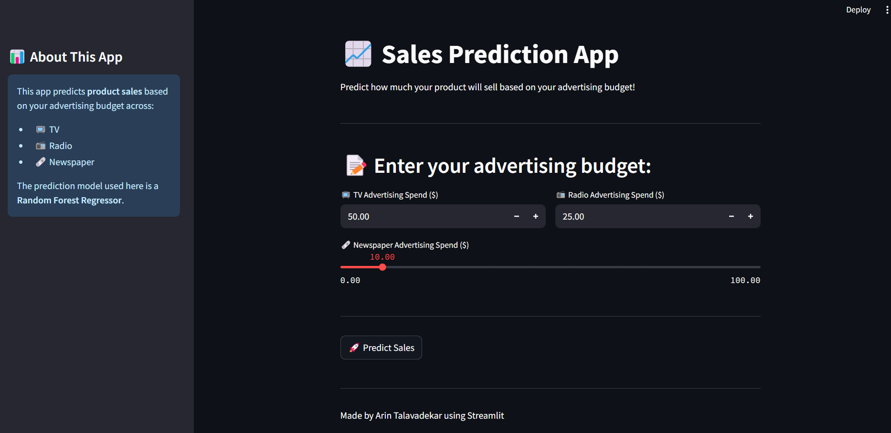
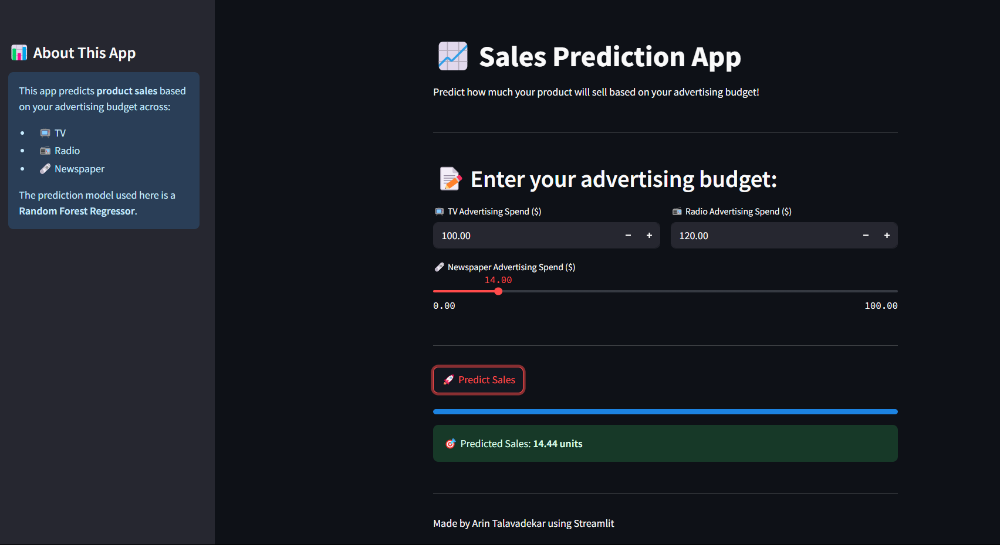

# 📊 Sales Prediction App

A simple interactive **Streamlit** app that predicts product sales based on your advertising spend across TV, Radio, and Newspaper. The app uses a **Random Forest Regressor** model to make real-time predictions, providing valuable insights for businesses to optimize their advertising strategies.

## 🚀 Features
- **Machine Learning Model**: Random Forest Regressor
- **User-Friendly Interface**: Built with **Streamlit** for interactive input and output
- **Real-Time Predictions**: Input TV, Radio, and Newspaper advertising spend, and get the predicted sales
- **Visual Appeal**: Fun features like progress bars and a clean design

## 📈 Getting Started

### Prerequisites

Before you run the app, make sure you have Python installed (version 3.7 or higher) and the required dependencies.

### Installation

1. Clone this repository:

   ```bash
   git clone https://github.com/Arin-Talavadekar/Code_Alpha_Sales_Prediction.git

2. Install the necessary Dependencies 
   ```bash
   pip install -r requirements.txt
3. Run the App

    ```bash
    streamlit run app.py
## 📸 Screenshots

### 🔷 Homepage


### 🔷 Sales Prediction Result



## Author 
Arin Talavadekar
